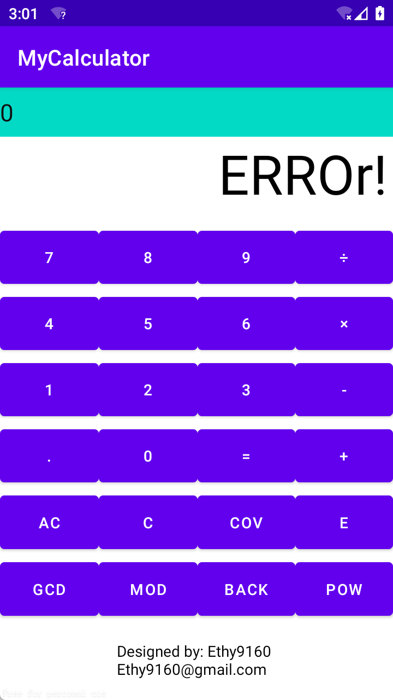

<h1 align = "center">《电子科学创新实验Ⅰ》课程报告</h1>

<p align = 'center'>学号</p>

<p align='center'>姓名</p>

# 简易计算器

# 摘要

通过学习java语言和android程序与界面设计，本项目基于`jdk1.8.301`和`android API21`，通过设计界面、研究算法，使用intellj IDEA开发软件，设计出一款支持科学计数的能够进行精确四则运算、取公因数、取模灯功能的手机计算器app。


# 设计流程


## 设计目的

1、完成简单的四则运算的精确运算。

2、完成求余数、求公因数、乘方（整数值）功能。前两者若输入为真小数，则返回0。

3、完成科学计数法的输入与输出。

## 设计思路

1、 使用`java.BigDecimal`完成基本精确的运算，避免浮点型运算导致的非准确结果。

2、使用xml文件对布局进行设计和优化。

3、使用多态以在未来实现可能的相似功能的继承和相异功能的独立完成。


## 部分功能参考代码

### 布局

根据计算器特征，项目使用`GrideLayout`进行排版。

```JAVA
<GridLayout xmlns:android="http://schemas.android.com/apk/res/android"
            android:layout_width="match_parent"
            android:layout_height="match_parent"
            android:columnCount="4"
            android:orientation="horizontal"
            android:rowCount="6" >

        <TextView

                android:layout_columnSpan="4"
                android:layout_rowSpan="2"
                android:layout_width="match_parent"
                android:gravity="center_vertical"
                android:textColor="#111111"
                android:background="@color/teal_200"
                android:id="@+id/record_text"
                android:text="tap to begin..."
                android:textSize="22sp"
                android:layout_height="45dp"/>

        <TextView
                android:layout_columnSpan="4"
                android:layout_rowSpan="2"
                android:layout_gravity="fill"
                android:layout_marginLeft="5dp"
                android:layout_marginRight="5dp"
                android:textColor="#000000"
                android:id="@+id/display_text"
                android:text=""
                android:textSize="50sp"
                android:layout_height="80dp"/>


        <Button
                android:text="7"
                android:id="@+id/button7"
                android:layout_columnWeight="1"
                android:layout_rowWeight="1" />

        <Button
                android:text="8"
                android:id="@+id/button8"
                android:layout_columnWeight="1"
                android:layout_rowWeight="1" />

        <Button
                android:text="9"
                android:id="@+id/button9"
                android:layout_columnWeight="1"
                android:layout_rowWeight="1" />

        <Button
                android:text="÷"
                android:id="@+id/buttonDivide"
                android:layout_columnWeight="1"
                android:layout_rowWeight="1" />

        <Button
                android:text="4"
                android:id="@+id/button4"
                android:layout_columnWeight="1"
                android:layout_rowWeight="1" />

        <Button
                android:text="5"
                android:id="@+id/button5"
                android:layout_columnWeight="1"
                android:layout_rowWeight="1" />

        <Button
                android:text="6"
                android:id="@+id/button6"
                android:layout_columnWeight="1"
                android:layout_rowWeight="1" />

        <Button
                android:text="×"
                android:id="@+id/buttonMultiply"
                android:layout_columnWeight="1"
                android:layout_rowWeight="1" />

        <Button
                android:text="1"
                android:id="@+id/button1"
                android:layout_columnWeight="1"
                android:layout_rowWeight="1" />

        <Button
                android:text="2"
                android:id="@+id/button2"
                android:layout_columnWeight="1"
                android:layout_rowWeight="1" />

        <Button
                android:text="3"
                android:id="@+id/button3"
                android:layout_columnWeight="1"
                android:layout_rowWeight="1" />

        <Button
                android:text="-"
                android:id="@+id/buttonMinus"
                android:layout_columnWeight="1"
                android:layout_rowWeight="1" />

        <Button
                android:text="."
                android:id="@+id/buttonDecimal"
                android:layout_columnWeight="1"
                android:layout_rowWeight="1" />

        <Button
                android:text="0"
                android:id="@+id/button0"
                android:layout_columnWeight="1"
                android:layout_rowWeight="1" />

        <Button
                android:text="="
                android:id="@+id/buttonEquals"
                android:layout_columnWeight="1"
                android:layout_rowWeight="1"
                android:layout_rowSpan="1" />

        <Button
                android:text="+"
                android:id="@+id/buttonPlus"
                android:layout_columnWeight="1"
                android:layout_rowWeight="1" />

        <Button
                android:text="AC"
                android:id="@+id/buttonAC"
                android:layout_columnWeight="2"
                android:layout_rowWeight="1"
                android:layout_columnSpan="1" />

        <Button
                android:text="C"
                android:id="@+id/buttonC"
                android:layout_columnWeight="2"
                android:layout_rowWeight="1"
                android:layout_columnSpan="1" />

        <Button
                android:text="Cov"
                android:id="@+id/buttonConvert"
                android:layout_columnWeight="1"
                android:layout_rowWeight="1"
                android:layout_rowSpan="1" />


        <Button
                android:text="E"
                android:id="@+id/buttonE"
                android:layout_columnWeight="1"
                android:layout_rowWeight="1"
                android:layout_columnSpan="1" />


        <Button
                android:text="@string/GCD"
                android:id="@+id/buttonGetCommonDivisor"
                android:layout_columnWeight="1"
                android:layout_rowWeight="1"
                android:layout_columnSpan="1" />

        <Button
                android:text="@string/MOD"
                android:id="@+id/buttonMod"
                android:layout_columnWeight="1"
                android:layout_rowWeight="1"
                android:layout_columnSpan="1" />

        <Button
                android:text="BACK"
                android:id="@+id/buttonBack"
                android:layout_columnWeight="1"
                android:layout_rowWeight="1"
                android:layout_columnSpan="1" />

        <Button
                android:text="POW"
                android:id="@+id/buttonPow"
                android:layout_columnWeight="1"
                android:layout_rowWeight="1"
                android:layout_columnSpan="1" />

        <TextView
                android:layout_columnSpan="4"
                android:layout_rowSpan="2"
                android:layout_gravity="center"
                android:layout_marginLeft="5dp"
                android:layout_marginRight="5dp"
                android:textColor="#000000"
                android:id="@+id/display_null"
                android:text="\nDesigned by: Ethy9160\nEthy9160@gmail.com"
                android:textSize="14sp"
                android:layout_height="71dp"/>

</GridLayout>
```

布局效果：


### 资源文件代码

项目使用默认资源。

### 项目逻辑代码

项目通过一个`calculator.java`（abstract class）作为计算器最顶层容器，`CalculatorTool.java`（interface）作为计算器基本功能接口，采用多态拟实现：

* `BasicCalculator.java`

  采用浮点数进行计算，计算精度不高且范围有限，已舍弃。

* `WebCalculator.java`

  云计算器，通过将输入和计算请求发送到服务端进行计算，减少本地系统资源占用。由于服务器的开启需要经费，未实现。

* `AdvancedCalculator.java`

  科学计算器，能够实现高精度、大数字的计算，且功能相对丰富。

将`MainActivity.java`的事件监听与计算器逻辑代码进行绑定，从而实现项目的基本功能。

#### 主要代码展示

`calculator.java`

作为顶层容器，便于具体功能实现时接入该接口。

```java
package com.example.myapplication.calculator;

import android.view.View;
import android.widget.Button;
import android.widget.TextView;
import com.example.myapplication.R;

import java.math.BigDecimal;
import java.math.BigInteger;

public abstract class Calculator implements CalculatorTool{

    final String STRING_ZERO = "0";
    protected boolean hasDecimalPoint = false;
    protected TextView displayText, recordText;
    protected String currentInput = "";
    protected String currentOperator = "";
//    protected int currentDecimalPlace;

    protected boolean isOver;

    /**
     * 当<code>onButtonClick()</code>方法中，识别到+、-、*、/、gcd、mod后，
     * 将会调用这个方法。
     * @param operator 运算符
     */
    protected abstract void handleOperatorInput(String operator);
    protected abstract void handleEqualsInput();
    protected abstract void updateResultDisplayText();
    public abstract void handleActualClearInput();
    public abstract void handleScienceInput();

    public Calculator(TextView displayText, TextView recordText){
        this.displayText = displayText;
        this.recordText = recordText;
    }

    public void delete(){
        if(!currentInput.isEmpty()){
            if(currentInput.length()==1) {
                currentInput = STRING_ZERO;
                displayText.setText(currentInput);
                return;
            }
            if(currentInput.charAt(currentInput.length()-1) == '.') hasDecimalPoint = false;
            currentInput = currentInput.substring(0,currentInput.length()-1);
            displayText.setText(currentInput);
        }
    }
    
    
    /**
     * 输入小数点。此处在避免重复输入小数点，也要防止使用“BACK“键后再点击小数点的失效。
     */
    protected void handleDigitInput(String digit){
        if(isOver) handleActualClearInput();

        currentInput += digit;
        displayText.setText(currentInput);
    }
    
    protected void handleDecimalInput() {
        if(isOver){
            handleClearInput();
        }
        if (!hasDecimalPoint) {
            if(currentInput.isEmpty()) currentInput = "0.";
            else currentInput += ".";
            displayText.setText(currentInput);
            hasDecimalPoint = true;
        }
    }
    
    public void onButtonClick(View view){
        switch (view.getId()){
            case R.id.button0:
            case R.id.button1:
            case R.id.button2:
            case R.id.button3:
            case R.id.button4:
            case R.id.button5:
            case R.id.button6:
            case R.id.button7:
            case R.id.button8:
            case R.id.button9:
                if(!currentInput.isEmpty() && !currentInput.contains(".") && currentInput.charAt(0)=='0') currentInput = "";
                handleDigitInput(((Button)view).getText().toString());
                break;
            case R.id.buttonE:
                handleScienceInput();
                break;
            case R.id.buttonDecimal:
                handleDecimalInput();
                break;

            case R.id.buttonMultiply:
            case R.id.buttonMinus:
            case R.id.buttonDivide:
            case R.id.buttonPlus:
            case R.id.buttonGetCommonDivisor:
            case R.id.buttonMod:
            case R.id.buttonPow:
                handleOperatorInput(((Button) view).getText().toString());
                break;

            case R.id.buttonEquals:
                handleEqualsInput();
                break;
            case R.id.buttonC:
                handleClearInput();
                break;
            case R.id.buttonAC:
                handleActualClearInput();
                break;
            case R.id.buttonConvert:
                if(currentInput.isEmpty())return;
                if (currentInput.charAt(0) == '-') {
                    currentInput = currentInput.substring(1);
                }else currentInput = "-"+currentInput;
                displayText.setText(currentInput);
                break;

            case R.id.buttonBack:
                delete();
                break;
        }
    }
    protected int getDecimalPlaces(String value){
        String[] parts = value.split("\\.");
        if (parts.length == 1) {
            return 0;
        } else {
            return parts[1].length();
        }
    }
    protected void calculateResult(String operator){
        switch (operator){
            case "+":
                plus();
                break;

            case "-":
                minus();
                break;

            case "×":
                multiply();
                break;
            case "÷":
                divide();
                break;

            case "MOD":
                mode();
                break;

            case "GCD":
                gcd();
                break;


            case "POW":
                pow();
                break;


            default:
                break;
        }
        updateResultDisplayText();
        isOver = true;
    }

    protected void handleClearInput(){
        currentInput = "";
//        currentDecimalPlace = 0;
        isOver = false;
        hasDecimalPoint = false;
//        currentOperator = "";
        displayText.setText("0");
    }

    protected void pow(){

    }

    public void mode(){

    }

    public void gcd(){

    }

    /**
    判断该bigDecimal是不是整数
    */
    private boolean isInt(BigDecimal bigDecimal){
        return new BigDecimal(bigDecimal.intValue()).compareTo(bigDecimal) == 0;
    }

    private boolean isInputInteger(String input){
        int len = input.length();
        for (int i = 0; i < len; ++i) {
            if(input.charAt(i) == '0') return false;
        }
        return true;
    }

    protected static String getRecordOperator(String o1, String o2, String currentOperator){
        switch (currentOperator){
            case "POW":
                return String.format("%s^%s",o1,o2);
            case "GCD":
                return String.format("(%s, %s)", o1, o2);
            case "MOD":
                return String.format("%s|%s", o1, o2);
        }
        return String.format("%s%s%s", o1,currentOperator,o2);
    }
}

```

其中，`CalculatorTool.java`:

```java
package com.example.myapplication.calculator;

public interface CalculatorTool<T> {
    void plus();

    void minus();

    void multiply();

    void divide();
}
```


`AdvancedCalculator.java`

一个很菜的“高级”计算器。该代码具有强屎山性，因此仅对部分具有**代表性的代码进行展示**。其余代码将会放在原始文件。

```java
package com.example.myapplication.calculator;


import android.annotation.SuppressLint;
import android.widget.TextView;

//import static java.math.BigInteger.ZERO;
import static java.math.BigDecimal.ZERO;

import java.math.BigInteger;
import java.math.BigDecimal;

public class AdvancedCalculator extends Calculator implements Runnable{
    private BigDecimal operand1, operand2, result;
    
    public AdvancedCalculator(TextView displayView, TextView recordText) {
        super(displayView, recordText);
        this.operand1 = ZERO;
        this.operand2 = ZERO;
        this.result = ZERO;
    }
    
    /**
     * 当使用者输入一个操作符的时候，需要进行的操作。
     * +：加法，或者科学输入的正号
     * -：减法，或者科学输入的负号
     * *、÷：运算符
     * 注意，如果之前的计算结果没有被清楚，即使用者没有按下归零，那么结果将会被赋值给operand1，并进行计算。
     * @param operator 运算符
     */
    @Override
    protected void handleOperatorInput(String operator) {
        if(isOver) isOver = false; //continu to calculate
        //已经有输入
        if (!currentInput.isEmpty()) {//if there esitst input, we need to judge whether to operator, in order to avoid like 1+2+3...(continuous add)
            //先前已经有输入的符号，说明这是继续计算。
            if(operator.charAt(0) == '-' && handleMinusOperator())return;
            if(operator.charAt(0) == '+' && handlePlusOperator())return;
            if (!currentOperator.isEmpty()) {//continuous add
                //calculate the result, and update the result to operand1.
                try {
                    handleEqualsInput();//先假装按了等号
                    handleOperatorInput(operator);//然后按下计算符号
                }catch (StackOverflowError e){
                    displayText.setText("TEL");
                    handleActualClearInput();
                }
                return;
            }else{//否则，给operand1赋值。
                operand1 = new BigDecimal(currentInput);
            }

            currentInput = "";
            currentOperator = operator;//update opetator
            hasDecimalPoint = false;
        }else{//only to change the operator
            if(!currentOperator.isEmpty()) currentOperator = operator;
        }
//        currentOperator = operator;
    }
    
    @Override
    protected void handleEqualsInput() {
        if (!currentInput.isEmpty() && !currentOperator.isEmpty()) {
            operand2 = new BigDecimal(currentInput);
            calculateResult(currentOperator);
            //set the record text
            String record = String.format("%s=%s", getRecordOperator(operand1.toString(), operand2.toString(), currentOperator), displayText.getText());
            recordText.setText(record);
            currentInput = result.toString();
            currentOperator = "";
            hasDecimalPoint = new BigDecimal(result.intValue()).compareTo(result) != 0;
            operand1 = result;
            operand2 = ZERO;
        }
    }
    
        /**
     * 科学计数输出——小数
     * 将一个长度过长的小数转变为科学输出，避免超过计算器显示范围。
     * @param s
     * @return
     */
    private String toDecimalScienceNumber(String s){

        if(s.contains("E")) {
            return s;
        }

        int len = s.length();
        if(len < 7) return s;
        
        if(s.charAt(0) !='0') {
            if(len > 7){
                String[] s2 = s.split("\\.");
                int intLen = s2[0].length();
                String withoutDecimal = s2[0] + s2[1];
                BigInteger i1 = new BigInteger(withoutDecimal.substring(0, 3));

                if(withoutDecimal.charAt(4) > '4'){
                    if(s.charAt(0) == '-') i1 = i1.subtract(new BigInteger("1"));
                    else i1 = i1.add(new BigInteger("1"));
                }
                StringBuilder stringBuilder = new StringBuilder(i1.toString());
                if(stringBuilder.charAt(0) == '-') stringBuilder.insert(2,'.');
                else stringBuilder.insert(1,'.');
                stringBuilder.append('E').append(intLen-1);
                s = stringBuilder.toString();

            }
            return s;
        }
        s = s.substring(2);
        int l = 0;
        try {
            while (s.charAt(l++) == '0');//得到l的值
        }catch (StackOverflowError e){
            //todo
            e.printStackTrace();
        }

        s = s.substring(l-1);//变成整数
        String res_temp;
        if(s.length() > 4)
            //判断四舍五入
            res_temp = toIntegerScienceNumber(s);
        else
            res_temp = s;
        String[] res = res_temp.split("E");

        StringBuilder sb = new StringBuilder(res[0]);


        if(sb.length() > 1)
            sb.insert(1,'.');
        sb.append('E').append('-').append(l);

        return sb.toString();

    }

    /**
    将一串整数数字设置为科学计数法。请<b>保证输入的是一个仅包含数字的字符串变量</b>
     @param s 输入的字符串
     @return 科学计数法
     <p>
     todo: 对科学计数法进行四舍五入。完成<code>if(sb.charAi(8)>'4')</code>语句。</p>
     */
    @SuppressLint("DefaultLocale")
    private String toIntegerScienceNumber(String s){

        StringBuilder sb = new StringBuilder(s);
        int len = sb.length()-1;
        if(sb.charAt(4) > '4'){
            sb.setLength(4);
            BigDecimal bigDecimal = new BigDecimal(sb.toString());
            bigDecimal = bigDecimal.add(new BigDecimal(1));
            sb = new StringBuilder(bigDecimal.toString());
        }
        else sb.setLength(4);
        sb.insert(1,'.');
        sb.append('E').append('+').append(len);
        return sb.toString();
    }
}
```

更多代码请见`附件-计算器完整项目代码`，或参阅[SUSTC_EE317_Android_applications](https://github.com/Ethylene9160/SUSTC_EE317_Android_applications/tree/main)。该仓库为本项目设计者用于存储项目文件的仓库。

## 功能截图

### 开屏界面


### 寻找最大公因数


### 科学计算


完整功能展示参见视频。

## 展望

本项目通过采用`BigDecimal.java`，运用继承、多态等知识，通过对界面布局进行优化等，完成了一个简易计算器的制作。尽管项目作实现了基本的逻辑要求，一些问题仍然不可抗拒。一方面，项目作者为了贴合该计算器的输出方式，并未完全采用`BigDecimal.java`提供的科学计数方法，在官方方法和作者自定义方法的冲突下，本计算器科学计数法存在一些问题。未来的作者可以统一需要调用的方法，避免相似环境下采用不同输出造成的问题。此外，项目代码逻辑较为混乱，并且由于项目作者对计算器存储原理、堆、栈的知识掌握并不牢靠，在部分操作下容易触发计算器对异常的捕获，影响使用体验，将来的开发者可以在深入学习计算机组成原理和存储原理后，再进行开发和优化。

# 附录

## 部分按钮功能介绍

`COV`: convert。将当前输入的正负性翻转。

`E`: 科学计数单位。$1E3$相当于$1\times 10^3$。

`GCD`: get common divisor。寻找最大公约数。仅有整数能够实现该功能，当输入小数时，返回0。

`MOD`: 求余数。仅有整数能够实现该功能，当输入小数时，返回0。

`BACK`: 回格。往前删除一位。

`POW`：乘方。仅支持$a^b$, b为整数的情况。如b不是整数，将取b的整数部分进行计算。

## 减少异常的出现

本项目对用户可能的输入进行了预判。包括但不限于：切换运算符、不点击等号的情况下连续计算、在`GCD` `MOD`下输入小数、在`GCD` `MOD`下输入含小数点的整数（如15.0）、删除小数点后重新输入小数点、直接输入小数点以输入小于0的小数等。这些将在演示视频中出现，但是由于用户需求多样，种类繁多，并未全部在标题提及。

此外，本项目有尝试防止特殊状态的程序崩溃。使用时，使用者或因后台应用、或因程序自带的漏洞，可能发生程序崩溃。代码采用异常捕获，若发生指针异常，将会重新初始化各变量，防止程序崩溃，并在输出端口弹出`ERROR`。此时，按下`AC`即可继续正常使用计算器。


