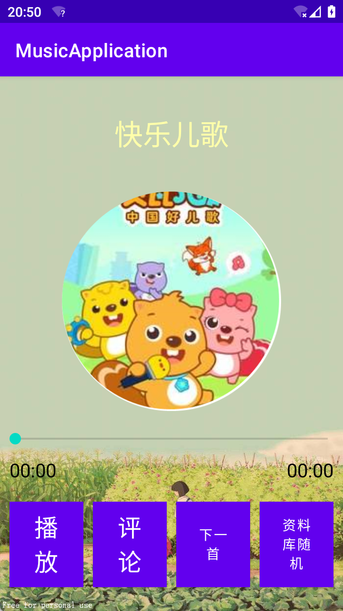

<h1 align = "center">《电子科学创新实验Ⅱ》课程报告</h1>
<center><b>
    音乐播放器设计报告 </center></b></p></center><center><b>姓名：董锦达</b></center><center></p><b>学号：12111829</b></center><center></p><b>系别：SDIM</b></center><center></p><b>专业：自动化</b></center><center></p><b>指导老师：徐琳琳</b></center>

# 简易音乐播放器

  ## 摘要

通过学习java语言和android程序与界面设计，本项目基于`jdk1.8.301`和`android API21`，通过设计界面、研究算法、搭建服务器，使用intellj IDEA开发软件，设计出一款支持网络连接的能够进行音乐播放的音乐播放app。

## 设计流程

### 设计目的

1、完成基本的音乐播放、暂停、跳转等功能

2、完成简单的网络交互

### 设计思路

1、 继承`Service`完成基本的音乐后台播放，避免占用前台资源。

2、使用xml文件对布局进行设计和优化。

3、使用静态代理以优化线程管理。

## 实验代码展示（部分）

### 播放器部分

#### Activity及布局简介

`MainActivity`: 使用RecycleView进行布局，用以展示歌单。顶部有联网按钮和登录按钮。


在用户登陆后，登录按钮将变为用户信息显示按钮（“降临者”为登陆的用户名）：

`MusicActivity`: 简单改造课程样例。包含专辑图片（可动画旋转）、进度条、播放/暂停按钮、评论按钮、下一首按钮、循环模式选择按钮。



`LoginActivity`: 普通的登录界面。


`RegisterActivity`: 普通的注册界面。


`UserActivity`: 用户信息显示界面。


`CommentActivity`：评论区界面。


`itemlayout.xml`：给RecycleView提供的单个子界面。


由于实验者理工屎的的审美风格，界面布局偏向于简陋，基本参考于网上各处，因此本实验将倾向于拓展该app的功能性。

#### 逻辑代码（部分）

* 音乐存储对象

`MusicDemo.java`：用于保存音乐信息的类。

```java
public class MusicDemo {
    private String musicName;
    private String artist;
    private String volumn;
    private int img;//专辑图片
    private int musicFile;//音乐资源id
    private Comments comments;//该音乐对应的评论
    private int price;

    public MusicDemo(String musicName, String artistm, String volumn, int img, int musicFile){
        this.musicName = musicName;
        this.artist = artistm;
        this.volumn = volumn;
        this.img = img;
        this.musicFile = musicFile;
    }

    public int getPrice() {
        return price;
    }

    public boolean canBuy(int given){
        return !(given < this.price);
    }

    public void setPrice(int price) {
        this.price = price;
    }
    public String getMusicName() {
        return musicName;
    }

    public String getArtist() {
        return artist;
    }

    public String getVolumn() {
        return volumn;
    }

    public int getImg() {
        return img;
    }

    public int getMusicFile() {
        return musicFile;
    }

    public Comments getComments() {
        return comments;
    }

    @Override
    public String toString(){
        return String.format("%s%s%s", musicName, artist, volumn);
    }

    //重写equals方法，对每个musicDemo来说，其歌手、专辑、歌名即可对应一个demo。
    @Override
    public boolean equals(Object o){
        if(!(o instanceof MusicDemo)) return false;
        return this.toString().equals(o.toString());
    }

    //重写hashCode方法，以便能够直接提高该类在java的数据表（包括但不限于数组、链表、哈希映射等
    @Override
    public int hashCode(){
        return this.toString().hashCode();
    }
}
```

`MyDate.java`一个用于存储时间信息的类。

```JAVA
public class MyDate {
    private int year, month, day, h, m, s;

    public MyDate(int year, int month, int day, int h, int m, int s) {
        this.year = year;
        this.month = month;
        this.day = day;
        this.h = h;
        this.m = m;
        this.s = s;
    }

    public MyDate(){
        this(Calendar.getInstance(TimeZone.getTimeZone("UTC+8")));
    }

    public MyDate(Calendar c){
        this(c.get(Calendar.YEAR),
                c.get(Calendar.MONTH)+1,
                c.get(Calendar.DATE),
                c.get(Calendar.HOUR_OF_DAY),
                c.get(Calendar.MINUTE),
                c.get(Calendar.SECOND)
        );
    }

    /**
     * 打包方法：直接打包成字符串,没被用上。
     * @param msg
     */
    public MyDate(String msg) {
        this(msg.charAt(0), msg.charAt(1), msg.charAt(2), msg.charAt(3), msg.charAt(4), msg.charAt(5));
    }

    @SuppressLint("DefaultLocale")
    public String getDetailTime() {
        return String.format("%d,%2d,%2d %02d:%02d:%02d", year, month, day, h, m, s);
    }

    @SuppressLint("DefaultLocale")
    public String getDay() {
        return String.format("%d,%d,%d", year, month, day);
    }
}

```

`User.java`用户类。

```JAVA
public class User {
    public static final Image DEFAULT_AVAR = null;
    public static final String DEFAULT_KEY = "666666";
    private String name;
    private String id, key;
    private Image avar;


    public User(String name, String id, Image avar) {
        this(name, id, DEFAULT_KEY, avar);
    }

    public User(String name, String id, String key, Image avar){
        this.name = name;
        this.id = id;
        this.key = key;
        this.avar = (avar == null? DEFAULT_AVAR : avar);
    }

    public User(String name, String id, String key){
        this(name, id, key, DEFAULT_AVAR);
    }

    public User(String name, String id){
        this(name, id, DEFAULT_AVAR);
    }

    public String getGeneralInfo(){
        return String.format("%s&%s", this.id, this.name);
    }
    //已省略部分getters和setters。
}
```

`Comments.java`：存储一系列评论信息。

```java
public class Comments{
    private List<SingleComment> commentList;
    public Comments(SingleComment...singleComment){
        commentList = new ArrayList<>();
        commentList.addAll(Arrays.asList(singleComment));
    }

    //todo: 完成对list的遍历
    @Override
    public String toString(){
        StringBuilder builder = new StringBuilder();
        for (SingleComment comment : commentList) {
            builder.append(comment).append("\n\n");
        }
        return builder.toString();
    }

    public List<SingleComment> getList(){
        return this.commentList;
    }

    public void refresh(SingleComment...newComments){
        if(newComments == null) return;
        commentList.clear();
        commentList.addAll(Arrays.asList(newComments));
    }

    public void put(SingleComment c){
        this.commentList.add(0,c);
    }
}
```

`SingleComment.java`单个评论。

```JAVA
public class SingleComment {
    private User user;
    private MyDate myDate;
    private String comment;

    public SingleComment(User user, String comment, MyDate myDate) {
        this.user = user;
        this.myDate = myDate;
        this.comment = comment;
    }

    @Override
    public String toString() {
        return String.format("%s %s\n%s", user.getName(), myDate.getDetailTime(), comment);
    }
}
```

`Constants.java`：保存了一些常量。

* 服务类

`MusicService.java`

```java
public class MusicService extends Service {

    // 设置两个成员变量
    public MediaPlayer player;//声明一个多媒体对象
    private Timer timer;//声明一个时钟对象

    public MusicService() {
    }

    @Nullable
    @Override
    public IBinder onBind(Intent intent) {
        return new MusicControl();//将MusicControl()返回给onBind（）方法，这样绑定服务的时候，可以把音乐控制器实例化。
    }

    @Override
    public void onCreate() {
        super.onCreate();
        player = new MediaPlayer();//实例化多媒体
    }

    @Override
    public void onDestroy() {
        super.onDestroy();
        if (player == null) return;
        if (player.isLooping()) player.stop(); //停止播放音乐
        player.release();//释放资源
        player = null;
    }

    //创建一个内部类MusicControl，功能是让主程序控制sevise里面的多媒体对象。IBinder 是Binder的子类，因此要返回MusicControl给IBinder。
    class MusicControl extends Binder {
        int song;

        void setSong(int song) {
            this.song = song;
        }

        public MediaPlayer getMediaPlayer() {
            return player;
        }

        public void play() {//开始播放
            try {
                if (player != null) player.reset();//重置音乐播放器
                player = MediaPlayer.create(getApplicationContext(), song); //加载多媒体文件

                player.start(); //开始播放音乐
                addTimer();//添加计时器
            } catch (Exception exception) {//catch用来处理播放时产生的异常
                exception.printStackTrace();
            }
        }

        public void pausePlay() {//暂停播放
            player.pause();
        }

        public void continuePlay() {//继续播放
            player.start();
        }

        public void stopPlay() { //暂停播放
            player.stop();
            player.release();
            try {
                timer.cancel();
            } catch (Exception e) {
                e.printStackTrace();
            }
        }

        public void seekTo(int progress) {//定义播放位置播放
            player.seekTo(progress);
        }

        public void changeMusic(MusicDemo demo) {
//            this.demo = demo;
            if (player != null) {
                player.stop();
                player.release();
                player = null;
                if (timer != null) {
                    timer.cancel();
                    timer = null;
                }
            }

            player = MediaPlayer.create(getApplicationContext(), demo.getMusicFile()); // 根据传入的音乐资源id创建新的MediaPlayer对象
//    player.prepareAsync();
            player.setOnPreparedListener(new MediaPlayer.OnPreparedListener() { // 监听器，当音乐准备好后开始播放
                @Override
                public void onPrepared(MediaPlayer mp) {
                    mp.start();
                    addTimer(); // 添加计时器，更新音乐进度
                }
            });

        }
    }

    //添加计时器，计时器是一个多线程的东西，用于设置音乐播放器中的进度条信息
    public void addTimer() {
        if (timer == null) {
            timer = new Timer();
            TimerTask task = new TimerTask() {//实例化一个计时任务对象
                @Override
                public void run() { //run就是多线程的一个东西,用于service和主线程（即MainActivity）之间的通信
                    if (player == null) return; //如果player没有实例化，就不执行下面的代码。
                    int duration = player.getDuration();//获取歌曲总长度
                    int currentDuration = player.getCurrentPosition();//获取歌曲当前播放进度
                    //将音乐的总时长、播放时长封装到消息对象中去；
                    Message message = MusicActivity.handler.obtainMessage();//在主线程获取一个消息空间
                    Bundle bundle = new Bundle();//定义一个包裹，将歌曲总长度和当前播放长度打包放进去
                    bundle.putInt("duration", duration);
                    bundle.putInt("currentDuration", currentDuration);
                    message.setData(bundle);//将消息包括给message
                    MusicActivity.handler.sendMessage(message);//将消息添加到主线程中
                }
            };
            //开始计时任务后5ms，执行第一次任务，以后每500ms执行一次任务
            timer.schedule(task, 5, 1000);
        }
    }
}
```

* Activity类

`MainActivity.java`

静态成员变量：

```java
    public static WebController controller;//app共用一个网络代理
    private static boolean isConnected, isRegisted;//状态记录

    public static User user;//app共用一个登录用户信息
```

主要方法展示：

```JAVA
public class MainActivity extends AppCompatActivity implements WebInterface {
	//已省略部分变量、方法
    @Override
    public void webAction(String message) {
        msgProcess(message.charAt(0), message.substring(1));
    }
    
    
    /**
     * 对来自服务器的信息进行处理
     * @param c 标记
     * @param msg 信息
     */
    private void msgProcess(char c, String msg) {
        String info[] = msg.split("#");
        switch (c) {
            case StringServer.CONNECTED_SUCCESS:
                isConnected = true;
                runOnUiThread(new Runnable() {
                    public void run() {
                        Toast.makeText(getApplicationContext(), "成功连接到服务器。", Toast.LENGTH_SHORT).show();
                    }
                });
                break;
            case StringServer.TRUE_ANSWER:
                isRegisted = true;
                user = new User(info[0], info[1], info[2], null);
                runOnUiThread(new Runnable() {
                    public void run() {
                        loginButton.setText(user.getName());
                        Toast.makeText(getApplicationContext(), "登陆成功。\n欢迎"+user.getName(), Toast.LENGTH_SHORT).show();
                    }
                });
                break;
            case StringServer.WRONG_ANSWER:
                runOnUiThread(new Runnable() {
                    public void run() {
                        Toast.makeText(getApplicationContext(), "账号或密码错误。", Toast.LENGTH_SHORT).show();
                    }
                });
                break;
            case StringServer.ERROR:
                controller = null;
                isConnected = false;
                isRegisted = false;
                runOnUiThread(new Runnable() {
                    @SuppressLint("SetTextI18n")
                    public void run() {
                        loginButton.setText("登录");
                        Toast.makeText(getApplicationContext(), "网络异常，连接失败。", Toast.LENGTH_SHORT).show();
                    }
                });
                break;
            case StringServer.GET_COMMENCE:
                CommentActivity.setComment(msg);
//                CommentActivity.iv_comments.setText(msg);
                runOnUiThread(new Runnable() {
                    @SuppressLint("SetTextI18n")
                    public void run() {
                        Intent intent = new Intent(getApplicationContext(),CommentActivity.class);
                        startActivity(intent);
                    }
                });
                break;
                case StringServer.SYSTEM_INFO:
                    runOnUiThread(()->{
                        Toast.makeText(getApplicationContext(), "系统消息:\n"+msg, Toast.LENGTH_SHORT).show();
                    });
                    break;
            case StringServer.LOG_OUT:
                isRegisted = false;
                runOnUiThread(()->{
                    loginButton.setText("登录");
                    Toast.makeText(getApplicationContext(), "您已成功登出。", Toast.LENGTH_SHORT).show();
                });
                break;
                case StringServer.CONTACT:
                    runOnUiThread(()->{
                        Toast.makeText(getApplicationContext(), info[0]+"发送了一条私信：\n"+info[1], Toast.LENGTH_SHORT).show();
                    });
                    break;
            case StringServer.SIGN_UP:
                runOnUiThread(()->{
                    Toast.makeText(getApplicationContext(), "注册成功! 你的id为："+msg, Toast.LENGTH_LONG).show();
        });
                break;

        }
    }
    
    private class MyAdapter extends RecyclerView.Adapter<MyAdapter.MyHolder> {
        //...
    }
    
    //声明MyHolder里面都有哪些控件，并和itemlayout里面的控件一一对应
    public class MyHolder extends RecyclerView.ViewHolder {
        ImageView miv_image;
        TextView mtv_name, mtv_info;
        public MyHolder(@NonNull View itemView) {
            super(itemView);
            miv_image = itemView.findViewById(R.id.iv_image);
            mtv_name = itemView.findViewById(R.id.tv_name);
            mtv_info = itemView.findViewById(R.id.tv_information);
        }
    }
}
```

`MusicActivity.java`音乐播放界面对应的java文件，主要是对事件进行监听。已省略部分变量、方法和课程参考代码。

```JAVA
public class MusicActivity extends AppCompatActivity{
    public void setCurrentDemo(MusicDemo currentDemo);//设置当前的音乐信息
    private void startMusic() ;//播放音乐
    private void changeMusic(MusicDemo demo);//改变当前正在播放的歌曲
    private void pause(){
        if(isPause){
            //继续播放音乐
            control.continuePlay();
            //光盘继续转
            animator.resume();
            pauseButton.setText("暂停");
        }else{
            //停止播放音乐
            control.pausePlay();
            //光盘停止转
            animator.pause();
            pauseButton.setText("播放");
        }
        isPause = !isPause;
    }
}
```

由于与播放控制有关的按钮只有一个，所以暂停按钮对应事件监听还有：

```JAVA
				case R.id.btn_pause://切换音乐
                    if(!isStart){//没开始，那么将状态设置为开始，并开启音乐服务。
                        startMusic();
                        isStart = true;
                        return;
                    }
                    pause();
                    break;
```

`UserActivity.java`

```JAVA
public class UserActivity extends AppCompatActivity {
    private Button changePasswardButton, changeNameButton, msgButton;
    private Button logoutButton;
    private TextView tv_name, tv_id;
    
    @Override
    protected void onCreate(Bundle savedInstanceState) {
        super.onCreate(savedInstanceState);
        setContentView(R.layout.activity_user);
        changePasswardButton = findViewById(R.id.change_password_button);
        logoutButton = findViewById(R.id.logout_button);
        changeNameButton = findViewById(R.id.change_name_button);
        msgButton = findViewById(R.id.message_button);

        tv_name = findViewById(R.id.name);
        tv_id = findViewById(R.id.id);
        tv_name.append(MainActivity.user.getName());
        tv_id.append(MainActivity.user.getId());
        
        changePasswardButton.setOnClickListener(v->changePassward());
        logoutButton.setOnClickListener(v->logout());
        changeNameButton.setOnClickListener(v->changeName());
        msgButton.setOnClickListener(v-> contact());
    }
    
    /**
     * 点击”发送“按钮后的事件
     * 通过setInputType(inptType.TYPE_CLASS_NUMBER)方法，使用者在ID框内只能输入数字
     */
    private void contact();
    
    /**
     * 改密码事件
     */
    private void changePassward();
    
    /**检查密码长度、内容是否符合要求。
     * 这个方法同时用来检查username是否符合标准，因为功能相似所以没有专门写针对username的检查方法。
     * @param newPassword 新密码（新用户名）
     * @return 是否合法
     */
    private boolean checkNewPassword(String newPassword);
    
    /**登出
     *
     */
    private void logout();
    
    /**改用户名
     *
     */
    private void changeName();
}
```

由于篇幅有限，`CommentActivity.java`、`LoginActivity.java`、`RegisterActivity.java`将不展示。

### 网络部分

通过静态代理，新开设线程以实现网络化。

`WebInterface.java`: 静态代理接口

```java
public interface WebInterface {
    void webAction(String message);
}
```

`WebController.java`: 代理，真正进行收发消息的”工具人“。限于篇幅，其工作代码入附件原始代码，或者参考[Ethylene9160/useless_web_interface (github.com)](https://github.com/Ethylene9160/useless_web_interface)。

```JAVA
public class WebController{
    private WebInterface web;//代理对象
    private Socket serverSocket;
    private Sender sender;//发送消息的实现对象
    private Receiver receiver;//接收消息的实现对象
    
    public WebController(WebInterface web);//构造方法，初始化变量，并建立和代理对象的通信。
    
    public void send(String message);//使用sender，发送消息
}

class Sender implements Closeable{
    private DataOutputStream outputStream;
    //private boolean flag = true;

    /**
     * impliment of multiple thread to realize <code>send(String str)</code> method, to avoid taking up current thread.
     * @param str message to be sent
     */
    void send(String str) {
        new Thread(()->{
            try {
                this.outputStream.writeUTF(str);
                this.outputStream.flush();
            } catch (IOException var3) {
                //this.flag = false;
                WebUtil.closeAll(this.outputStream);
                var3.printStackTrace();
            }
        }).start();
    }
    
    public Sender(Socket client) {
        try {
            this.outputStream = new DataOutputStream(client.getOutputStream());
        } catch (IOException e) {
            //this.flag = false;
            WebUtil.closeAll(this.outputStream, client);
            e.printStackTrace();
        }
    }

    @Override
    public void close() throws IOException {
        this.outputStream.close();
    }
}

class Receiver implements Runnable, Closeable {
    private DataInputStream inputStream;

    private boolean flag = true;
    private WebInterface web;
    public String getData;

    public Receiver(Socket client, WebInterface web) {
        this.web = web;
        try {
            this.inputStream = new DataInputStream(client.getInputStream());
        } catch (IOException e) {
            this.flag = false;
            e.printStackTrace();
            WebUtil.closeAll(this.inputStream, client);
        }

    }

    public DataInputStream getInputStream() {
        return this.inputStream;
    }

    private String getMessage() {
        try {
            return this.inputStream.readUTF();
        } catch (IOException e) {
            this.flag = false;
            web.webAction(String.valueOf(StringServer.ERROR));
            WebUtil.closeAll(this.inputStream);
            e.printStackTrace();
        }
        return "E";
    }

    private void readFile(){

    }

    @Override
    public void run() {
        while (this.flag) {
            this.getData = this.getMessage();
            this.web.webAction(getData);
            System.out.println("ck Receivevr: 获取到数据：" + this.getData);
        }
    }

    @Override
    public void close() throws IOException {
        WebUtil.closeAll(inputStream);
    }
}
```

`WebUtil.java`: 提供`static closeAll(Closeable...c)`方法，快速关闭大量需要关闭的IO流等。

### 服务器部分

`StringServer.java`服务器打开的入口。包含几个静态变量：

`musicList`:  保存音乐信息的映射

`users`：保存用户信息的映射

`listMap`保存在线用户的映射

```JAVA
public class StringServer{
    public static final char ANNOUNCE_COMMENCE = 'a', GET_COMMENCE = 'b', LOG_IN = 'c', SIGN_UP = 'd', WRONG_ANSWER = 'e', TRUE_ANSWER = 'f',
            FIND_PLAYER = 'g', CONTACT = 'h', SYSTEM_INFO = 'i', CONNECTED_SUCCESS = 'j', ERROR = 'k', LOG_OUT = 'l',CHANGE_PASSWARD = 'm',
            CHANGE_NAME = 'n';
    public static Map<String, MusicDemo> musicList = getMusicList(null);
    public static Map<String, User> users;//todo
    public static Map<String, StringChannel> listMap = new HashMap<>();
    public static int webID;
    public static void main(String[] args) throws IOException {

        users = getUsers(null);
        webID  = 100;//
        System.out.println("start");
        ServerSocket moveServer = new ServerSocket(8888);
        while(true){
            webID ++;
            Socket socket = moveServer.accept();
            StringChannel stringChannel = new StringChannel(socket);
            stringChannel.ownID = String.valueOf(webID);
            System.out.println("someone comes"+(listMap.size()+1));
            //
//            new DataOutputStream(socket.getOutputStream()).writeUTF('a'+Integer.toString(webID));
            new DataOutputStream(socket.getOutputStream()).writeUTF(String.valueOf(CONNECTED_SUCCESS));
            listMap.put(String.valueOf(webID), stringChannel);
        }
    }

    private static Map<String, User> getUsers(String path){
        //todo: creat this map from local saved file.
        //算了
		//        return null;
        HashMap<String, User> map = new HashMap<>();
        map.put("10001", new User("降临者","10001", "123456",0));
        map.put("10002", new User("Spark","10002", "123456",0));
        return map;
        //return new HashMap<>();
    }
    
    static void save(String outputFile){
        //todo: save users to a local file.
    }

    //判断用户账号密码对应情况
    static boolean isUser(String id, String key){
        User u = users.get(id);
        if(u == null) return false;
        return u.getKey().equals(key);
    }

    static Map<String, MusicDemo> getMusicList(String path) {
        HashMap<String, MusicDemo> map = new HashMap<>();
        for (MusicDemo demo : Constants.musicLists) {
            map.put(demo.toString(), demo);
        }
        return map;
    }

    static String findOnlinePlayer(){
        StringBuilder sb = new StringBuilder();
        for (StringChannel value : listMap.values()) {
            if(value.ownID.length() > 3){
                sb.append(Objects.requireNonNull(users.get(value.ownID)).getGeneralInfo()).append("#");
            }
        }
        sb.deleteCharAt(sb.length()-1);
        return sb.toString();
    }
}
```

`StringChanner(Inner class)`: 每个接入的客户机，都会获得一个channel进行一对一服务，它将对所连接的客户机进行交互和信息处理，也能够和Server中其它在线channel进行交互，并实现转发功能。

```JAVA
class StringChannel implements WebInterface {
    String ownID;
    User myself;
    WebController controller;
    public StringChannel(Socket clientSocket){
        controller = new WebController(clientSocket, this);
    }
    @Override
    public void webAction(String message) {
        try {
            messageProcess(message.charAt(0), message.substring(1));
        }catch (NullPointerException e){
            controller.send(String.valueOf(StringServer.ERROR));
            e.printStackTrace();
            StringServer.listMap.remove(ownID);
        }
    }
    private void messageProcess(char ch, String msg){
        String[] info = msg.split("#");
        switch (ch){
            case StringServer.ANNOUNCE_COMMENCE:
                //musicName#comment
                announceCommence(info[0], info[1]);
                break;
            case StringServer.GET_COMMENCE:
                this.controller.send(getCommence(info[1]));
                break;
            case StringServer.LOG_IN:
                //old_id#id#key
                //old_id=""
                new Thread(()->{
                    if(StringServer.isUser(info[1], info[2])){
                        StringServer.listMap.remove(ownID);
                        ownID = info[1];
                        StringServer.listMap.put(info[1], this);
                        myself = StringServer.users.get(info[1]);
                        StringChannel.this.controller.send(StringServer.TRUE_ANSWER +myself.getName() +"#"+myself.getId()+"#"+myself.getKey());
                        System.out.println("successful!"+ownID);
                    }else{
                        StringChannel.this.controller.send(StringServer.WRONG_ANSWER + "");
                        System.out.println("failed!");
                    }
                }).start();
                break;
            case StringServer.SIGN_UP:
                //name#key
                ownID = StringServer.users.size() + 10001 + "";
                User user = new User(info[0], ownID, info[1]);
                StringServer.users.put(ownID, user);
                this.controller.send(StringServer.SIGN_UP + ownID);
//                myself = StringServer.users.get(info[1]);
                break;
            case StringServer.FIND_PLAYER:
                //output: id&name
                this.controller.send(StringServer.findOnlinePlayer());
                break;
                case StringServer.CHANGE_NAME:
                    this.myself.setName(msg);
                    this.controller.send(StringServer.SYSTEM_INFO+"用户名修改成功！");
                    break;
            case StringServer.CONTACT:
                //please make sure that, in info[1], there is your personal id or name to ensure the target confirm who you are.
                User u0 = StringServer.users.get(info[0]);
                if(u0 == null) {
                    this.controller.send(StringServer.SYSTEM_INFO + "查无此人。请检查ID是否正确");
                    return;
                }
                StringChannel u = StringServer.listMap.get(info[0]);
                if(u == null) this.controller.send(StringServer.SYSTEM_INFO + "发送失败，对方不在线。");
                else u.controller.send(StringServer.CONTACT+myself.getName()+"#"+info[1]);


                break;
            case StringServer.LOG_OUT:
                StringServer.listMap.remove(myself.getId());
                myself = null;
                this.controller.send(String.valueOf(StringServer.LOG_OUT));
                break;
                case StringServer.CHANGE_PASSWARD:
                    myself.setKey(msg);
                    this.controller.send(StringServer.SYSTEM_INFO+"密码修改成功！");
                    break;

            //todo: a way for buying the song
            //todo: a way for getting the users online
            //todo: add friend, also re-imply in User.java
            //todo: delete friend, also re-imply in User.java
            //todo: sub-comment
            //写不动了
        }
    }
    private void announceCommence(String musicName, String comment){
        SingleComment singleComment = new SingleComment(myself, comment, new MyDate());
        StringServer.musicList.get(musicName).getComments().put(singleComment);
    }
    private String getCommence(String musicName){
        return StringServer.GET_COMMENCE+StringServer.musicList.get(musicName).getComments().toString();
    }
}
```

## 部分功能展示

* 登录


* 注册


* 音乐播放


* 评论区


* 用户信息操作界面


## 视频功能详解

部分视频录制时，受于场地限制，没有开启声音。

`基础功能演示.mp4`：

> 歌单选择：选取某个歌曲，然后听。
>
> 播放、暂停按钮：若歌曲未播放，点击即可播放；否则为暂停。
>
> 进度条可拉扯。
>
> 随机播放模式选择：可以选择”同专辑随机“（随机播放与当前歌曲同专辑的歌曲）或者”资料库随机“（整个歌单中的歌曲随机播放）。

`网络功能展示2.mp4`

> 连接服务器：部分功能若不连接服务器，那么将会无法使用。
>
> 登录：私信发送、评论区发送需要登陆后才能使用。其中评论区查看只需要连接到服务器即可。该项目会对用户的输入进行判定。如果账户信息输入有误，则不会登录。登陆界面有注册按钮，供使用者进行注册。
>
> 注册：如展示所示。
>
> 个人信息查看：当使用者成功登陆后，原本的登录按钮会变成使用者的用户名，点击后即可查看个人信息。其功能如演示视频所示，包含更改用户信息、发送私信、登出。
>
> 评论区：使用者登陆后可以对歌曲进行评论。

`私信发送和接收.mp4`

>用户登陆后，在个人信息界面可以对在线的其它成员进行私信发送。输入对方的id和想要发送的信息，按下按钮即可发送私信。需要注意的是，如果id填写错误，将会被提示“查无此人”；对方不在线，将会提示“对方不在线”。收到消息的用户会将消息以Toast提醒的方式展现出来。视频展示的是机器发送私信给其它用户，以及收到名为Spark的用户发来的“666”私信。

`网络异常.mp4`

>如果网络发生异常，软件应当首先保证运行的稳定性。该视频展示了一个登陆的用户突遇网络故障后的情况：在用户登录并正常使用时，人为重启服务器造成连接中断，可以看到系统提示网络异常，同时主界面的“\*用户姓名\*”按钮变回了“登录”按钮。与此同时，后台也已记录下断网信息，使用者将暂时无法进行登录、查看评论区等操作，直到使用者再次点击“连接服务器”并成功连接到服务器。需要注意的是，只有在成功连接上服务器（而非按下按钮），收到服务器的反馈后，连接状态才会是真。

`评论功能.mp4`

> 展示的是某客户机实时查看评论区的变化。（在该客户机使用者操作时，有其他用户对该歌曲进行了评论）

## 展望

本项目运用静态代理、多线程等知识，通过对线程进行优化等，完成了一个简易音乐播放器的制作。尽管项目作实现了基本的逻辑要求，一些问题仍然不可抗拒。一方面，项目作者对于UI的设计不够熟悉，大量界面参考网络上的简单UI，UI设计过于简陋；另一方面，笔者对于线程管理并不熟练，不能很好的进行后台activity与前台activity交互，实现方法清奇且冗长。将来的开发者可以在深入学习计算机组成原理、存储原理，理解进程、线程之间的交互后，进行开发和优化。

## 其它


*`Ethy9160`为本项目作者在github上的昵称。

